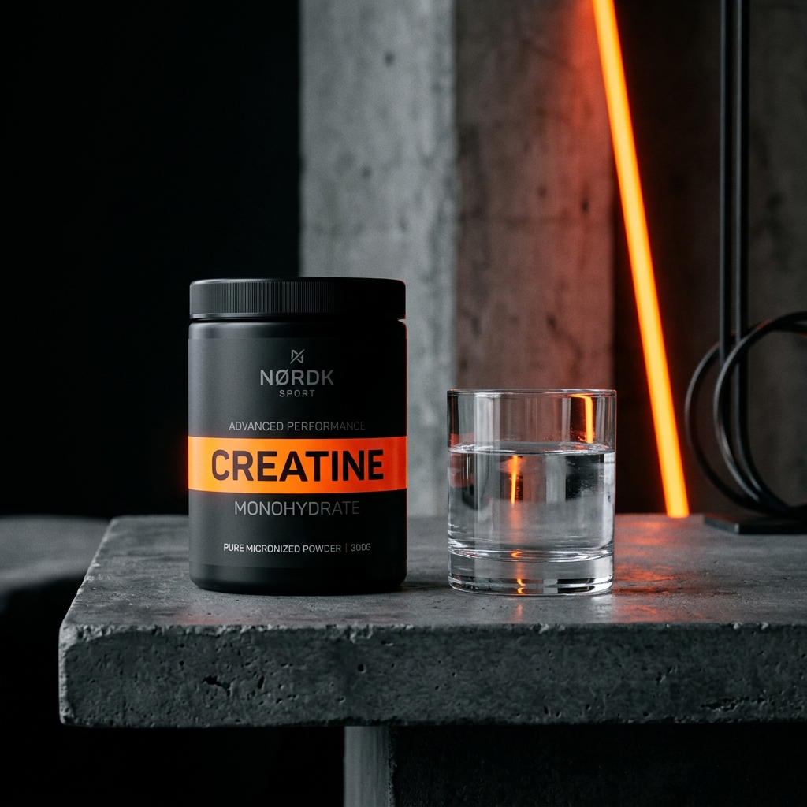
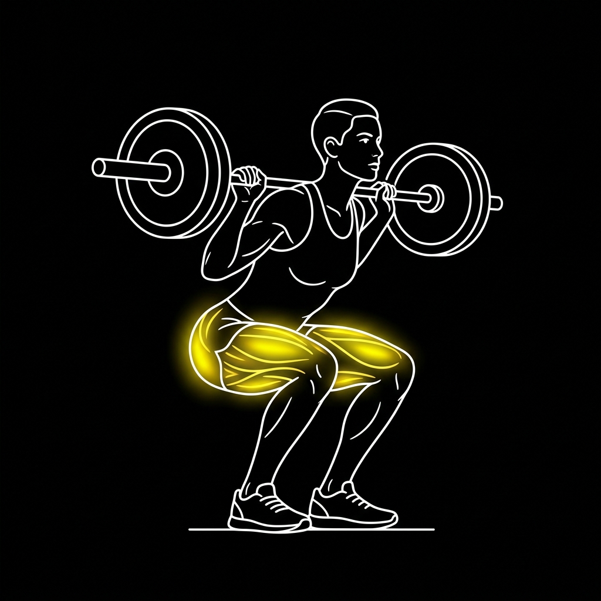
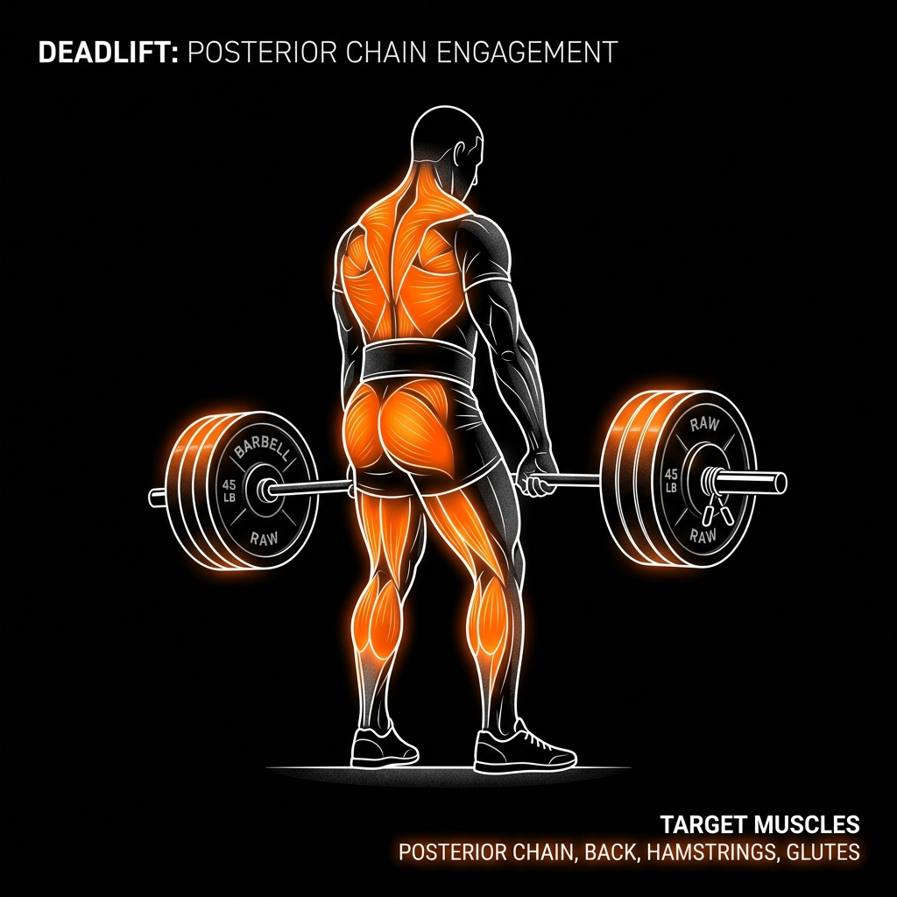

# 🏋️ BÁO CÁO NGHIÊN CỨU & KẾT LUẬN: THỰC PHẨM & TPCN HỖ TRỢ TẬP GYM
*Tài liệu tổng hợp nghiên cứu khoa học dựa trên phân loại của Hiệp hội Dinh dưỡng Thể thao Quốc tế (ISSN) và Viện Thể thao Úc (AIS)*

> [!TIP]
> 👉 **[Bấm vào đây để xem phiên bản giao diện thiết kế đẹp mắt (HTML)](Nghien_Cuu_Dinh_Duong_Gym.html)** đọc trực tiếp trên trình duyệt Chrome/Edge.

---

## 🔬 PHẦN 1: THỰC PHẨM CHỨC NĂNG (SUPPLEMENTS)
Dựa theo mức độ bằng chứng khoa học, các chất bổ sung được chia làm các nhóm hiệu quả từ cao xuống thấp:

### 🌟 Nhóm A: Hiệu Quả Rõ Rệt (Được chứng minh lâm sàng mạnh mẽ nhất)

#### 1. Creatine Monohydrate (TPCN tăng sức mạnh tối ưu nhất)
* **Tổng quan tác dụng:**
  - **Tái tạo ATP (Năng lượng tức thì):** Tăng cường lượng phosphocreatine dự trữ trong cơ, chuyển hóa nhanh ADP thành ATP để cung cấp năng lượng tức thì cho các động tác nâng tạ bùng nổ (sức mạnh 1RM, chạy nước rút).
  - **Tích nước nội bào (Cell Hydration):** Hút nước vào bên trong tế bào cơ (không phải tích nước dưới da gây béo). Giúp tế bào cơ căng phồng, kích hoạt tổng hợp protein và làm cơ bắp trông to tròn hơn.
  - **Tăng sức mạnh & hiệu suất:** Đã được chứng minh lâm sàng giúp tăng 5-15% sức mạnh và số reps thực hiện ở các set tạ cuối cùng, kích thích phì đại cơ tối đa.
  - **Hỗ trợ não bộ:** Nghiên cứu mới cho thấy creatine cải thiện chức năng nhận thức, trí nhớ và giảm mệt mỏi tinh thần khi bị thiếu ngủ.
* **Cách lựa chọn dựa trên bảng thành phần (Supplement Facts):**
  - **Bước 1: Kiểm tra dạng Creatine (Form):** Nhìn dòng hoạt chất chính trong Supplement Facts, phải ghi rõ là **Creatine Monohydrate**. Tránh các dạng đắt đỏ khác như *Creatine HCL, Kre-Alkalyn (pH Buffered), Creatine Ethyl Ester* vì khoa học chứng minh chúng đắt gấp 2-3 lần nhưng hiệu quả hấp thu không hề vượt trội hơn Monohydrate thông thường.
  - **Bước 2: Tìm chữ "Micronized":** Ưu tiên sản phẩm ghi **Micronized Creatine Monohydrate**. Đây là hạt creatine được xay mịn hơn 20 lần, giúp bột dễ tan trong nước hơn, hạn chế tối đa việc lắng cặn ở đáy cốc và ngăn ngừa tình trạng đầy bụng hoặc tiêu chảy nhẹ ở những người bụng yếu.
  - **Bước 3: Xem danh sách thành phần phụ (Other Ingredients):** Một hũ Creatine chất lượng cao (loại không mùi - unflavored) thì danh sách thành phần phụ chỉ được có **đúng 1 thành phần duy nhất là Creatine Monohydrate**, không chứa đường, chất độn, hương liệu nhân tạo hay chất bảo quản.
  - **Bước 4: Nhận diện chứng chỉ tinh khiết (Creapure®):** Nếu trên bao bì có logo **Creapure®**, đây là nguồn Creatine Monohydrate siêu tinh khiết (99.9%+) được cấp bằng sáng chế sản xuất tại Đức, đảm bảo không lẫn tạp chất hay kim loại nặng. Đây là tiêu chuẩn vàng, giá sẽ nhỉnh hơn một chút.
  - **Bước 5: Định lượng (Dosing):** Một serving (muỗng) tiêu chuẩn nên chứa đúng **3g - 5g (3.000mg - 5.000mg)** Creatine. Tránh các loại sản phẩm pha chế sẵn (như pre-workout) có chứa creatine nhưng bị thiếu liều (chỉ có 1-2g) mà giá thành lại đắt.
* **Cách dùng khuyến nghị:**
  - Uống **5g/ngày** đều đặn vào mọi ngày (kể cả ngày nghỉ) để duy trì bão hòa cơ.
  - Nên pha chung với nước ấm, Whey Protein hoặc nước trái cây ngọt sau tập (đường carb nhanh trong nước trái cây kích thích insulin giúp vận chuyển creatine vào cơ nhanh hơn).
  - Không cần giai đoạn nạp tạ (loading phase) 20g/ngày gây hại tiêu hóa, cứ uống đều 5g/ngày sau 3-4 tuần cơ sẽ bão hòa hoàn toàn.

#### 2. Whey Protein (Đạm hấp thu nhanh)
* **Cơ chế:** Cung cấp nguồn đạm tinh khiết có giá trị sinh học cực cao (đầy đủ các axit amin thiết yếu EAA và BCAA, đặc biệt là Leucine giúp kích hoạt quá trình tổng hợp protein cơ bắp MPS).
* **Hiệu quả thực tế:** Tiện lợi, giúp bổ sung nhanh lượng đạm thiếu hụt từ bữa ăn thô, thúc đẩy phục hồi cơ bắp siêu tốc ngay sau tập.
* **Cách dùng khuyến nghị:**
  - Dùng **1-2 muỗng (scoop) hằng ngày** vào bữa phụ hoặc ngay sau khi tập 15-30 phút.
  - *Mẹo chọn:* Ưu tiên **Whey Isolate** hoặc **Hydrolyzed** để loại bỏ hoàn toàn đường Lactose, tránh bị đầy hơi, nổi mụn.

#### 3. Caffeine (Tăng sự tập trung & Sức bền)
* **Cơ chế:** Ngăn chặn adenosine gắn vào thụ thể thần kinh, giảm cảm giác mệt mỏi, tăng nhịp tim và lưu thông máu.
* **Hiệu quả thực tế:** Tăng sự tỉnh táo, tối ưu khả năng chịu đựng khi đẩy tạ nặng.
* **Cách dùng khuyến nghị:** **150 - 300mg** trước khi tập 30-45 phút. Không nên uống sau 5h chiều để tránh mất ngủ.

---

### 🧪 Nhóm B: Có Thể Hiệu Quả (Hỗ trợ bơm máu & Giảm tích tụ Axit Lactic)

#### 1. L-Citrulline Malate (Tăng bơm máu - Muscle Pump)
* **Cơ chế:** Tiền chất của L-Arginine, giúp gia tăng nồng độ Oxit Nitric (NO) trong máu, làm giãn nở mạch máu.
* **Hiệu quả thực tế:** Giúp vận chuyển oxy và chất dinh dưỡng vào cơ tốt hơn, giảm đau mỏi cơ cơ học trong buổi tập.
* **Cách dùng khuyến nghị:** **6g - 8g** trước tập 30-40 phút.

#### 2. Beta-Alanine (Hạn chế mỏi cơ - Ngứa da nhẹ)
* **Cơ chế:** Tăng nồng độ Carnosine trong cơ bắp, đóng vai trò như một chất đệm chống lại sự tích tụ axit lactic (nguyên nhân gây mỏi cơ, "cháy cơ").
* **Hiệu quả thực tế:** Giúp bạn thực hiện thêm được 1-2 rep tạ ở các hiệp tập dài (từ 8-15 reps).
* **Cách dùng khuyến nghị:** **3.2g - 6.4g/ngày**. Thường gây ra phản ứng phụ vô hại là ngứa rát nhẹ dưới da (Paresthesia).

---

### 🩺 Nhóm C: Hỗ Trợ Sức Khỏe Tổng Thể & Phục Hồi Khớp

#### 1. Dầu Cá Omega-3 (Chống viêm & Bảo vệ tim mạch)
* **Cơ chế:** Axit béo thiết yếu (EPA & DHA) giúp kháng viêm khớp, bôi trơn các khớp khi gánh tạ nặng, đồng thời tăng nhạy insulin để đẩy chất dinh dưỡng vào tế bào cơ.
* **Cách dùng:** **2.000 - 3.000mg/ngày** (khoảng 2 viên) sau bữa ăn có chất béo.

#### 2. Vitamin D3 & K2 (Tối ưu Testosterone & Canxi)
* **Cơ chế:** D3 giúp tăng cường sản sinh Testosterone nội sinh cho nam giới; K2 định hướng canxi đi thẳng vào xương thay vì lắng đọng ở mạch máu.
* **Cách dùng:** **1 viên** vào buổi sáng ngay sau khi ăn.

---

## 🥩 PHẦN 2: CHẾ ĐỘ ĂN THÔ TỰ NHIÊN (WHOLE FOODS)
*Chế độ ăn thô chiếm 90% kết quả. Tỷ lệ phân bổ Macros khuyên dùng cho mục tiêu tăng cơ nạc (Lean Bulk):*

```
[ Tổng Năng Lượng: 2250 - 2300 kcal/ngày ]
  ├─ Tinh bột (Carb): 280g - 300g (Cung cấp năng lượng nâng tạ)
  ├─ Chất đạm (Protein): 120g - 130g (Nguyên liệu xây dựng sợi cơ)
  └─ Chất béo tốt (Fat): 60g - 65g (Duy trì nồng độ Hormone nam)
```

### 🥚 Các loại thực phẩm tự nhiên tốt nhất cho từng nhóm:
1. **Nguồn đạm sạch (Protein):** 
   - *Ức gà fillet (không da):* ~31g protein/100g (Rẻ nhất, ít béo nhất).
   - *Lòng trắng trứng gà:* Có giá trị hấp thụ cao nhất (chứa albumin).
   - *Thịt bò nạc (thăn):* Giàu kẽm, sắt, và chứa sẵn lượng creatine tự nhiên.
   - *Cá thu, cá hồi:* Giàu đạm và chất béo tốt omega-3.
2. **Nguồn tinh bột tốt (Carb phức hợp):**
   - *Yến mạch:* Cung cấp năng lượng bền bỉ, giàu chất xơ beta-glucan.
   - *Khoai lang luộc / Hấp:* Tinh bột hấp thu chậm, giữ đường huyết ổn định.
   - *Gạo lứt:* Nhiều vitamin nhóm B hỗ trợ chuyển hóa năng lượng.
3. **Nguồn béo tốt (Fat tốt):**
   - *Quả bơ:* Chất béo không bão hòa đơn tốt cho tim mạch.
   - *Dầu Oliu Extra Virgin:* Dùng để trộn salad.
   - *Hạt hạnh nhân, hạt điều:* Bữa phụ tiện lợi giúp cung cấp chất béo tốt.

---

## ⏰ PHẦN 3: THỜI ĐIỂM NẠP DINH DƯỠNG (NUTRIENT TIMING)

### 1. Bữa ăn trước tập (Pre-workout)
* **Thời gian:** Ăn trước tập **1.5 - 2 tiếng**.
* **Thành phần:** Carb hấp thu chậm + Đạm vừa phải (Ví dụ: Yến mạch + 1 muỗng Whey; hoặc Khoai lang + Ức gà áp chảo). Tránh ăn quá nhiều chất béo trước tập vì làm chậm tiêu hóa gây nặng bụng.

### 2. Bữa ăn sau tập (Post-workout)
* **Thời gian:** Trong vòng **30 phút - 1 tiếng** sau tập.
* **Thành phần:** Carb nhanh + Đạm hấp thu nhanh (Ví dụ: 1 muỗng Whey Protein + 1 quả chuối chín lớn). Giúp khôi phục lại kho dự trữ glycogen nhanh chóng.

### 3. Tập gym buổi sáng khi áp dụng 16/8 (Nhịn ăn sáng)
* **Quan điểm khoa học:** Nghiên cứu lâm sàng từ ISSN chỉ ra rằng tập kháng lực khi bụng rỗng (fasted) hay bụng no (fed) **không tạo ra sự khác biệt đáng kể** về hiệu quả tăng cơ (hypertrophy) hay bảo toàn cơ bắp, miễn là **tổng lượng Calo và Protein trong ngày** của bạn đạt mục tiêu (ví dụ 120-130g protein). Việc giảm 15 cân thành công chứng minh cơ thể bạn thích nghi rất tốt với 16/8.
* **Những ảnh hưởng cần lưu ý khi chuyển sang tập gym sáng:**
  - *Hiệu suất tập luyện:* Đẩy tạ nặng khi bụng rỗng có thể làm bạn cảm thấy hơi thiếu lực ở các set cuối do cạn glycogen tức thời.
  - *Dị hóa cơ:* Tập nặng làm tăng cortisol (phá hủy cơ). Nếu tập xong lúc 9h sáng mà nhịn đến 12h trưa mới ăn (trễ 3 tiếng) sẽ bỏ lỡ thời điểm vàng phục hồi.
* **Giải pháp tối ưu hóa:**
  - **Cách 1 (Tốt nhất cho cơ bắp - Dịch chuyển khung giờ ăn):** Thay vì ăn 12h - 20h, hãy đổi sang **10h - 18h**. Bạn tập lúc 8h - 9h30, và ăn bữa đầu tiên ngay lúc 10h sáng để nạp đạm kịp thời.
  - **Cách 2 (Ăn nhẹ trước tập - "Bẻ luật nhẹ"):** Trước tập 30 phút ăn **1 quả chuối + ly cafe đen** (~90 kcal). Lượng carb nhỏ này tăng sức đẩy tạ đáng kể mà không làm ảnh hưởng nhiều đến trạng thái đốt mỡ của bạn.
  - **Cách 3 (Nếu bắt buộc nhịn tới 12h):** Uống nhiều nước + bổ sung **5g Creatine** trong lúc tập để giữ nước và hỗ trợ ATP tế bào cơ. Ăn bữa xả lúc 12h với tối thiểu 40g Protein.

---

## 💰 PHẦN 4: KẾT LUẬN & TỐI ƯU CHI PHÍ THỰC TẾ
Nếu bạn muốn phân bổ tài chính một cách khôn ngoan nhất, hãy chia ngân sách theo độ ưu tiên sau:

1. **Bắt buộc phải có (Chi phí thấp - Hiệu quả cao nhất):**
   - **Thức ăn thô:** Trứng gà, ức gà fillet (2.000.000đ/tháng).
   - **Creatine Monohydrate:** Chỉ khoảng 200.000đ/tháng nhưng tăng sức mạnh rõ rệt.
2. **Nên bổ sung nếu dư dả tài chính:**
   - **Whey Protein:** Tiện lợi cho bữa phụ (khoảng 600.000đ/tháng).
   - **Dầu cá Omega-3 & Vitamin D3K2:** (khoảng 250.000đ/tháng) giúp bảo vệ khớp lâu dài.
3. **Có thể bỏ qua (Ít hiệu quả so với giá thành):**
   - **Pre-workout hỗn hợp:** Rất đắt, có thể thay bằng ly cà phê đen không đường giá rẻ.
   - **BCAA dạng bột uống:** Nếu bạn đã ăn đủ đạm hoặc có uống Whey, BCAA là một sự lãng phí tiền bạc vì cơ thể đã có đủ.

---

## 💰 PHẦN 5: GIÁO ÁN ĂN & TPCN "SIÊU TIẾT KIỆM" (50.000đ/ngày)
*Thiết kế tối ưu hóa tỷ lệ Protein/Giá thành, loại bỏ hoàn toàn các loại thực phẩm bổ sung đắt đỏ (như Whey, Pre-workout) và chỉ giữ lại Creatine làm TPCN duy nhất.*

### 🛒 Bảng phân bổ ngân sách 50k/ngày:
| Thực phẩm / TPCN | Định lượng | Chi phí (VND) | Lượng Protein | Lượng Calo | Vai trò thực tế |
| :--- | :--- | :--- | :--- | :--- | :--- |
| **Ức gà fillet** | 250g | **16,000** | 77g | 300 kcal | Nguồn đạm chính, cực rẻ và nạc |
| **Trứng gà công nghiệp** | 3 quả | **9,000** | 18g | 210 kcal | Chất béo tốt từ lòng đỏ + đạm hoàn hảo |
| **Đậu hũ (Đậu phụ)** | 1 bìa (150g) | **3,500** | 12g | 110 kcal | Đạm thực vật lành tính, siêu rẻ |
| **Gạo tẻ** (nấu cơm thường) | 300g (cân khô) | **6,000** | 21g | 1050 kcal | Nguồn năng lượng (carb) chính |
| **Lạc (đậu phộng) rang** | 30g (1 nắm nhỏ) | **2,000** | 7g | 170 kcal | Chất béo tốt duy trì testosterone |
| **Chuối chín** | 2 quả | **3,000** | 2g | 180 kcal | Carb nhanh ăn trước tập |
| **Rau xanh + Gia vị** | Tùy chọn | **4,000** | 1g | 100 kcal | Chất xơ và gia vị nấu nướng |
| **Creatine Monohydrate** | 5g | **6,500** | 0g | 0 kcal | TPCN duy nhất để tối ưu sức mạnh cơ bắp |
| **TỔNG CỘNG** | | **50,000 VND** | **138g Protein** | **~2120 kcal** | **Lean Bulk tối ưu chi phí** |

*Ghi chú tính giá Creatine:* Hộp Creatine Monohydrate 300g có giá khoảng 400,000 VND, dùng được 60 ngày $\rightarrow$ Chi phí mỗi ngày chỉ ~6,600 VND.

---

### ⏱️ Lịch trình phân bổ bữa ăn trong ngày:

* **Sáng (Bữa 1): Cơm trứng & Đậu hũ**
  - 1 chén cơm lớn + 2 quả trứng gà ốp la/luộc + 1/2 bìa đậu hũ sốt cà chua.
* **Trưa (Bữa 2): Cơm gà & Rau xanh**
  - 1.5 chén cơm + 125g ức gà fillet áp chảo/luộc xé phay + Rau muống luộc.
* **Trước tập 45 phút (Bữa phụ): Chuối & Creatine**
  - Ăn 2 quả chuối chín + Uống 5g Creatine pha với nước ấm hoặc nước lọc.
* **Tối - Sau khi tập về (Bữa 3): Cơm gà & Trứng**
  - 1.5 chén cơm + 125g ức gà còn lại + 1 quả trứng gà luộc + 1/2 bìa đậu hũ luộc.
* **Trước khi đi ngủ 1 tiếng (Bữa phụ đêm): Lạc rang**
  - Ăn 1 nắm lạc rang (30g) để cung cấp chất béo tốt và đạm hấp thu chậm (casein-like từ thực vật), giúp nuôi cơ suốt đêm.

---

## 🧬 PHẦN 6: CÁC CHẤT DINH DƯỠNG CẦN THIẾT & BẢNG THÀNH PHẦN CHI TIẾT

Để tối ưu hóa quá trình xây dựng cơ bắp (tập tạ) và phục hồi, cơ thể cần được cung cấp đầy đủ các nhóm chất sau:

### 1. Các nhóm chất cần thiết nhất khi tập gym
* **Protein (Chất đạm - Axit amin):** Là gạch xây nhà. Khi tập tạ, các sợi cơ bị tổn thương vi mô (micro-tears), protein sẽ tổng hợp lại để vá và làm dày sợi cơ lớn hơn.
* **Carbohydrates (Tinh bột - Glycogen):** Là xăng chạy xe. Tinh bột chuyển hóa thành glycogen tích trữ trong cơ bắp và gan, là nguồn nhiên liệu trực tiếp và duy nhất giúp cơ co bóp mạnh mẽ khi nâng tạ.
* **Fats (Chất béo tốt):** Là dầu bôi trơn và điều hòa. Cần thiết để tổng hợp testosterone (hormone tăng cơ chính của nam giới) và bảo vệ màng tế bào, bôi trơn ổ khớp.
* **Nước & Điện giải (Natri, Kali, Magie):** Cơ bắp chứa 70% là nước. Thiếu nước hoặc mất điện giải qua mồ hôi sẽ gây mỏi cơ, giảm 10-20% sức mạnh và dễ bị chuột rút.
* **Vi chất quan trọng (Micronutrients):** 
  - *Vitamin D3:* Tăng sức mạnh cơ bắp và hệ miễn dịch.
  - *Canxi & Magie:* Canxi giúp co cơ, Magie giúp giãn cơ và cải thiện giấc ngủ sâu (thời điểm cơ bắp phục hồi mạnh nhất).
  - *Kẽm (Zinc):* Thúc đẩy tổng hợp hormone nam giới.

---

### 📊 Bảng thành phần dinh dưỡng chi tiết của các thực phẩm Gym phổ biến:
*(Thông số tính trên **100g thực phẩm dạng sống/chưa chế biến**, hoặc **1 quả** đối với trứng)*

| Nhóm | Tên thực phẩm | Năng lượng (kcal) | Protein (Đạm - g) | Carbs (Tinh bột - g) | Fats (Béo - g) | Vi chất & khoáng chất nổi bật |
| :--- | :--- | :--- | :--- | :--- | :--- | :--- |
| **Đạm sạch** | **Ức gà fillet** (nạc, không da) | 120 | **22.5** | 0.0 | 2.6 | Giàu vitamin B6, Niacin, phốt pho |
| **Đạm sạch** | **Thịt thăn bò** (nạc) | 140 | **22.0** | 0.0 | 5.5 | **Có sẵn Creatine tự nhiên**, Sắt, Kẽm |
| **Đạm sạch** | **Trứng gà nguyên quả** (1 quả ~50g) | 72 | **6.3** | 0.4 | 4.8 | Giàu Vitamin D, Choline, chất béo tốt |
| **Đạm sạch** | **Lòng trắng trứng** (1 quả ~33g) | 17 | **3.6** | 0.2 | 0.1 | Albumin tinh khiết, hấp thu siêu nhanh |
| **Đạm sạch** | **Cá rô phi phi-lê** | 96 | **20.0** | 0.0 | 1.7 | Selenium, vitamin B12, giá thành rẻ |
| **Đạm sạch** | **Cá hồi sống** | 208 | **20.0** | 0.0 | 13.0 | **Rất giàu Omega-3 (EPA & DHA)** |
| **Đạm sạch** | **Tôm sú tươi** | 85 | **20.0** | 0.0 | 0.9 | Giàu Canxi, Kẽm, đồng |
| **Đạm thực vật**| **Đậu hũ (Đậu phụ)** | 76 | **8.0** | 1.9 | 4.8 | Canxi thực vật, Isoflavones |
| **Tinh bột** | **Gạo tẻ / Gạo trắng** | 360 | **6.5** | **80.0** | 0.6 | Nguồn carb nhanh tiêu hóa dễ dàng |
| **Tinh bột** | **Gạo lứt** | 354 | **7.5** | **77.0** | 2.7 | Chỉ số GI trung bình, giàu chất xơ, Vitamin B1 |
| **Tinh bột** | **Yến mạch nguyên cám** | 389 | **16.9** | **66.0** | 6.9 | **Chất xơ Beta-Glucan**, Magie, sắt |
| **Tinh bột** | **Khoai lang luộc** | 86 | **1.6** | **20.0** | 0.1 | GI thấp, **Rất giàu Kali** chống chuột rút |
| **Tinh bột** | **Chuối chín** | 89 | **1.1** | **22.8** | 0.3 | Đường nhanh tiêu hóa nhanh, giàu Kali |
| **Béo tốt** | **Lạc (Đậu phộng) rang** | 567 | **25.8** | 16.0 | **49.2** | Giàu vitamin E, chất béo không bão hòa |
| **Béo tốt** | **Quả bơ chín** | 160 | **2.0** | 8.5 | **14.7** | Kali, Chất béo không bão hòa đơn tốt nhất |
| **Chất xơ** | **Bông cải xanh (Súp lơ)** | 34 | **2.8** | 7.0 | 0.4 | Giàu Vitamin C, K, chất chống oxy hóa |

---

## 7. Giải Phẫu Thực Phẩm Bổ Sung: Creatine Monohydrate ⚡
Creatine không phải là hormone hay steroid. Nó là một hợp chất tự nhiên có sẵn trong tế bào cơ, đóng vai trò tái tạo năng lượng phân tử ATP khi nâng tạ nặng hoặc bứt tốc lực.



### Cơ chế & Hiểu lầm:
* **Tích nước nội bào:** Creatine kéo nước vào trong tế bào cơ (Volumization), giúp cơ bắp căng mọng, đầy đặn. Hoàn toàn không gây tích nước dưới da (phù nề).
* **Hiệu suất:** Giúp bạn bứt phá thêm 1-2 reps cuối cùng trong các hiệp tạ nặng nhất.

### Giao thức Nạp (Dosing):
* **Nạp đều (Khuyên dùng):** 3 - 5g mỗi ngày, uống liên tục kể cả ngày nghỉ. Cơ bắp sẽ bão hòa sau 3-4 tuần.
* **Nạp nhanh:** 20g/ngày (chia 4 lần) trong 5-7 ngày đầu. Tác dụng nhanh hơn nhưng dễ gây kích ứng dạ dày.

---

## 8. Nguyên Lý Lõi & Lộ Trình Lịch Tập 3 Giai Đoạn 📅
Nguyên tắc cốt lõi của mọi lịch tập là **Quá Tải Lũy Tiến (Progressive Overload)** - tăng tạ, tăng số rep, hoặc giảm thời gian nghỉ theo thời gian.

### 📊 Lộ Trình Lịch Tập 3 Giai Đoạn

#### Giai đoạn 1: Tân Binh (Beginner / 0 - 6 tháng)
* **Lịch tập:** Full Body (Toàn thân) 3 ngày/tuần (Ví dụ: Thứ 2 - 4 - 6).
* **Trọng tâm:** Các bài tập đa khớp (Compound) như Squat, Deadlift, Bench Press.
* **Tần suất:** Cơ thể mới tập sẽ phục hồi rất nhanh và phản ứng tốt với tần suất tập cao để học kỹ thuật chuyển động.

#### Giai đoạn 2: Trung Cấp (Intermediate / 6 tháng - 2 năm)
* **Lịch tập:** Upper/Lower (Thân trên/Thân dưới) 4 ngày/tuần hoặc Push/Pull/Legs (PPL) 6 ngày/tuần.
* **Trọng tâm:** Gia tăng thể tích tập luyện (Volume), bổ sung các bài tập cô lập (Isolation) để kích thích phì đại cơ.

#### Giai đoạn 3: Cao Cấp (Advanced / Chuyên sâu)
* **Lịch tập:** Bro-Split (1 nhóm cơ/ngày) hoặc phân kỳ sức mạnh (Periodization).
* **Trọng tâm:** Khắc phục điểm yếu, siết cơ thi đấu kết hợp kỹ thuật tăng cường độ cao (Drop sets, Supersets).

---

### 🧠 Khảo sát khoa học: Tại sao 0-6 tháng lại tập Full Body?
* **Thích ứng thần kinh (Neural Adaptation):** Trong 6 tháng đầu, tăng sức mạnh chủ yếu do hệ thần kinh trung ương (CNS) tối ưu hóa đường truyền tín hiệu tới sợi cơ. Việc lặp đi lặp lại động tác 3 lần/tuần giúp não "học" động tác nhanh gấp 3 lần.
* **Thời gian tổng hợp Protein (MPS):** Ở người mới, MPS chỉ kéo dài 24-48 giờ sau tập. Tập Full Body cách ngày đảm bảo cơ bắp liên tục được kích thích và hồi phục.
* **Volume vừa đủ:** Người mới chưa thể chịu đựng khối lượng tập luyện quá lớn trong một buổi. Chia nhỏ 15-20 set/tuần ra 3 buổi Full Body là lựa chọn thông minh và an toàn nhất.

---

### 📏 Thư Viện Bài Tập & Nhóm Cơ Mục Tiêu

#### Các Bài Tập Đa Khớp (Compound Lifts)
* **Squat (Gánh đòn gánh):** Nhắm vào **Đùi trước (Quads)**, Mông (Glutes), Đùi sau (Hamstrings) và Core.
  
* **Deadlift (Kéo đòn tạ):** Nhắm vào **Đùi sau (Hamstrings)**, Mông, Lưng dưới và Lưng trên.
  
* **Bench Press (Đẩy ngực ngang):** Nhắm vào **Cơ ngực lớn (Chest)**, Vai trước và Tay sau.
* **Barbell Row (Chèo tạ đòn):** Nhắm vào **Cơ xô (Lats)**, Lưng giữa (Mid-back) và Tay trước.
* **Overhead Press (Đẩy tạ vai):** Nhắm vào **Cơ vai (Deltoids)**, Tay sau và Core.

#### Các Bài Tập Cô Lập (Isolation Lifts)
* **Bay vai ngang (Lateral Raise):** Nhắm vào **Vai giữa (Lateral Delts)** giúp tạo độ rộng vai.
* **Cuốn tay trước (Bicep Curl):** Nhắm vào **Tay trước (Biceps)**.
* **Nhấn cáp tay sau (Tricep Pushdown):** Nhắm vào **Tay sau (Triceps)**.

---

## 9. Cẩm Nang Bứt Phá Mức Tạ (Strength Mastery) 🔥💪

Muốn cơ bắp to, bạn phải tập cho cơ bắp Khỏe trước đã. Tăng sức mạnh (Strength Training) đòi hỏi một hệ thống luyện tập hoàn toàn khác biệt so với tập Phì đại (Hypertrophy).

### 🧠 Lập trình lại Hệ Thần Kinh (CNS)
Sức mạnh không chỉ đến từ độ lớn của cơ bắp, mà đến từ khả năng **Hệ thần kinh trung ương (CNS)** phát tín hiệu huy động (recruit) được càng nhiều sợi cơ co thắt cùng một lúc càng tốt.
* **Quy tắc 1-5 Reps:** Mức tạ từ 85% - 100% 1RM (1 Rep Max). Khối lượng tạ cực nặng sẽ "ép" hệ thần kinh phải bật hết công suất.
* **Nghỉ 3-5 Phút:** Tuyệt đối không nghỉ ngắn. Cơ bắp và hệ thần kinh cần ít nhất 3-5 phút để tái tạo hoàn toàn năng lượng ATP. Nếu bạn thở chưa xong đã vội vào set tiếp theo, bạn đang tập sức bền (Endurance), không phải sức mạnh.

### 📏 Khái Niệm Sống Còn: RPE & RIR
Đừng bao giờ tập đến sập (Failure) khi đang nâng tạ nặng, điều đó sẽ "nướng chín" hệ thần kinh của bạn và mất vài ngày để hồi phục.
* **RPE (Rate of Perceived Exertion) - Mức độ gắng sức:** Tập sức mạnh nên giữ ở RPE 8 - RPE 9. Tức là rất nặng nhưng vẫn kiểm soát được form chuẩn.
* **RIR (Reps in Reserve) - Rep dự trữ:** Luôn chừa lại 1 rep trong bình xăng (RIR 1). Ví dụ: Cảm thấy nâng được tối đa 5 cái, thì chỉ nâng 4 cái rồi cất tạ.

### ⚡ Dinh Dưỡng Bùng Nổ 💪
* Cắn 1/4 thìa muối biển (Sodium) pha với nước trước tập 30 phút để tăng khối lượng máu và pump cơ.
* Ăn Carb hấp thu nhanh (Chuối, kẹo dẻo) trong lúc tập để não không bị cạn kiệt Glucose.
* Không thể thiếu Creatine (3-5g/ngày) để dự trữ nguồn ATP dồi dào nhất.


